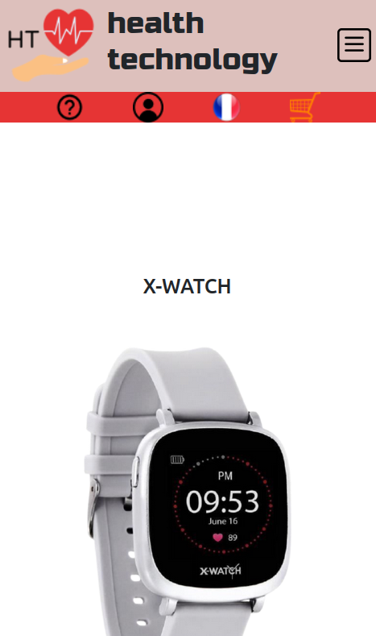

# E-commerce Website Mockup Project

This project was undertaken as part of my training program. The primary objective was to design a mockup of an e-commerce website using the Figma tool and then implement this mockup using HTML, CSS, and JavaScript to create a functional website. The project includes personas and a context to guide the design. I also learned how to design a mockup as part of this project.

  

## Figma Mockup

You can view the e-commerce website mockup by following this link: [Link to Figma Mockup](https://www.figma.com/file/EhzlVMCzlcTHGcDwmqg7X9/Maquette-e-commere?type=design&node-id=0-1&mode=design&t=X6rsbihS39x2E3Wp-0).

## How to Run the Project

To run this project on your own machine, follow these steps:

1. Clone the GitHub repository to your computer.
2. Open the `index.html` file in your web browser.
